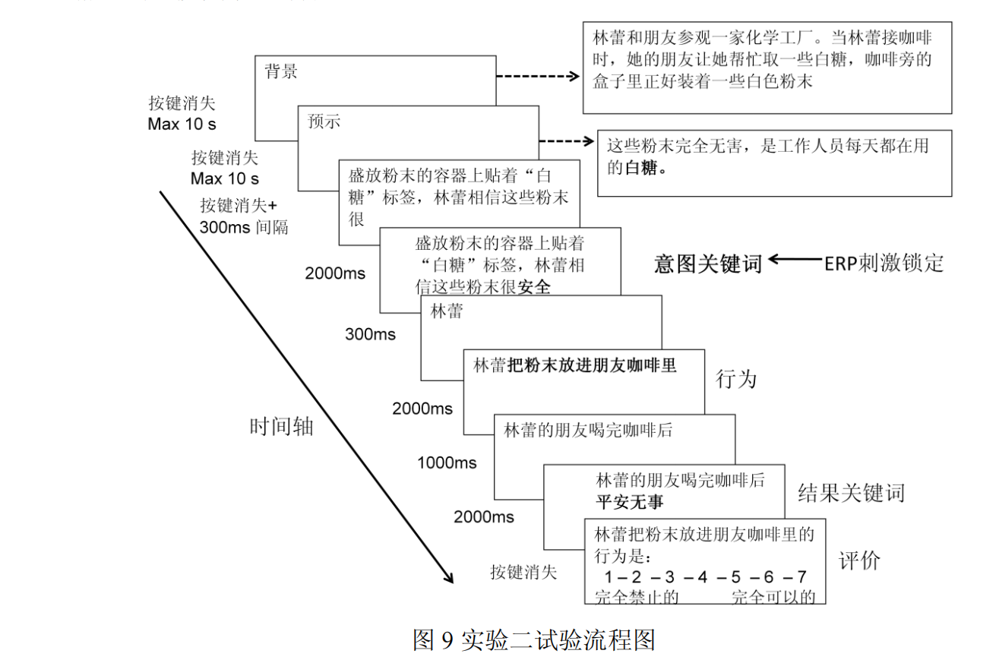
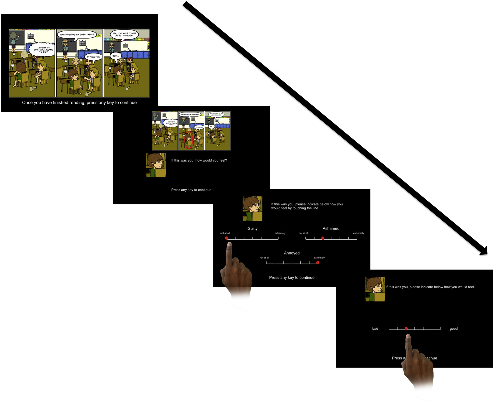
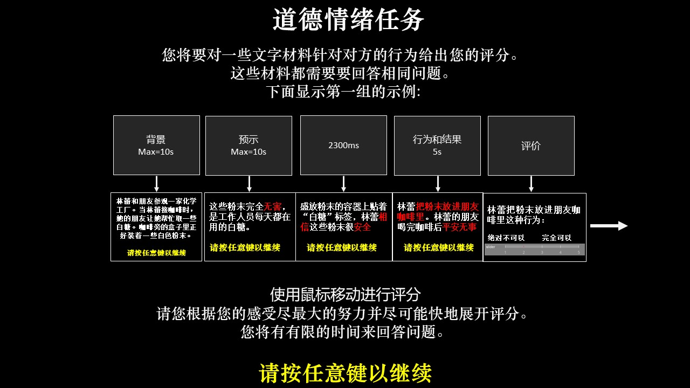

<h1 align="center">🍭Lab10_The Moral_Emotions_Task 道德情绪任务  </h1>
Project Name Psychopy Experimental programming design(Psychopy 实验编程设计)

> ### Operating System: Windows(可兼容Linux/MacOS)

> ### Programming Language and Version: Python 3.8

# References:

## 论文原文

Task originally described in

Reference:
[Bland, A., Schei, T., Roiser, J. P., Mehta, M. A., Zahn, R., Seara-cardoso, A., Viding, E., Sahakian, B. J., Robbins, T. W., &amp; Elliott, R. (2020). Agency and intentionality-dependent experiences of moral emotions. Personality and Individual Differences, 164, 110125. ](https://doi.org/10.1016/j.paid.2020.110125)

[Bland, A. R., Roiser, J. P., Mehta, M. A., Schei, T., Boland, H., Campbell-Meiklejohn, D. K., Emsley, R. A., Munafo, M. R., Penton-Voak, I. S., Seara-Cardoso, A., Viding, E., Voon, V., Sahakian, B. J., Robbins, T. W., &amp; Elliott, R. (2016). EMOTICOM: A Neuropsychological Test Battery to Evaluate Emotion, Motivation, Impulsivity, and Social Cognition. Frontiers in behavioral neuroscience, 10, 25.](https://doi.org/10.3389/fnbeh.2016.00025)

[道德判断中意图加工的神经机制及干预(2013)](materials/定稿-道德判断中意图加工的神经机制及干预-甘甜0529.pdf)

## Instruction

> This task examines the temporal processes and brain mechanisms involved in the processing and integration of hurtful intention information in a moral judgment task.
>
> A series of text materials were shown to the subjects, and they were asked to answer relevant questions according to the photos. Besides, information such as score and reaction time were collected under different situations to judge the relevant indicators.

这项任务考察个体在道德判断任务中加工伤人意图信息及整合相关信息的时间进程和脑机制。向被试展示系列文字材料，并要求他们根据照片回答相关的问题，并收集不同情境下打分分值和反应时等信息，判断相关指标。

## Materials

* 道德场景文字材料    Moral scene text material 伤人48题实验材料.docx

## Original task implementation comments

The experiment had a 2 (intention: negative and neutral) × 2 (outcome: negative and neutral) within-subject design.

> After the subjects completed the practice experiment, they were familiar with the experimental procedures and requirements, and then began the formal experiment. The formal experiment was divided into eight groups, a total of 160 trials, and each group had 20 trials. All stories were presented in pseudo-random order, with no repeated episodes in the five consecutive stories.

> Experimental procedure: After reading the background and foretelling of the story, the subjects pressed the space bar to advance. After reading the story, the subjects were asked to rate the permission degree of the protagonist's behavior (1-7 points were rated, 1 points were absolutely not allowed, 7 points were completely allowed).

> In order to meet the requirements of ERP experimental stimulus lock, we adjusted the experimental process: keywords in the intention and result part were screened out and marked in red, and presented at the end of the sentence, and the presentation time was delayed by 300ms, and ERP was locked at the moment of the intention keyword presentation.

> The score and reaction time of the subjects' permission judgment were recorded.

该实验为 2（意图：负性和中性）× 2（结果：负性和中性）的被试内设计。

> 被试先完成练习实验，熟悉实验程序和要求后，开始正式实验，正式实验分为八组，共 160 个 trials,每组 20 个 trials，完成每组实验后被试可休息一分钟左右。所有故事呈现顺序伪随机，连续出现的五个故事中没有重复的情节。

> 试验流程: 被试在阅读完故事背景和预示后，按空格键前进，看完故事后，要求被试评定主角行为的许可程度（1-7 分评定，1 分表示绝对不允许，7 分表示完全允许）移动滑块实现。

> 为了满足 ERP 实验刺激锁时的要求，我们对实验流程进行了调整：将意图和结果部分的关键词筛选出来并用红色标注，改为在句末呈现，并且呈现时延迟 300ms，ERP 锁定在意图关键词呈现的时刻。

> 实验记录被试做出许可度判断的评分及反应时。

## Time Taking:

> 9 minutes 9分钟

## Experimental Procedure：

## **指导语部分 Instruction Part**

## Other intruction 其他说明：

> 如果你觉得需要自己设计随机化的材料显示方案，请尝试删除并清空直接运行 **pre_process.py** 格式文件,将会对重新生成
> 选择sessions中限定的范围时1-3

> If you feel you need to design your own randomized material display scheme, please try deleting and clearing the files running directly in **pre_process.py** file

> Select range 1-3 in sessions at the beginning of the experiment

### 运行后文字材料生成的情况会发生变化

>> 实验结束后需要向被试展示相关结果，同时对数据进行总体的整合处理，筛选需要的信息以便于主试进行一系列统计学分析，这时我们运行**post_process.py**文件，输入被试编号即可，生成被试报告在output目录下，被试总体信息在**subjects_results.csv**格式文件中呈现，得到的是被试分别对应不同道德情境下行为的不同打分。
>>

### 对应的 **subject_results.csv** 文件的参数和含义如下所示：

> **subject_ID:**  被试的id编号

> **trials:** 被试总参加的试次

> **mean_score:** 被试总体打分平均值

> **mean_rt:**：被试参与总体打分的平均反应时

> **mean_goodPropose_happyEnd_score** 中性意图和正性结果条件下平均打分分值

> **mean_goodPropose_happyEnd_rt** 中性意图和正性结果条件下的平均反应时

> 后续的标签指标和上面类似，分别统计（意图：负性和中性）× 2（结果：负性和中性）情境下评分值（中性意图和负性结果、负性意图和中性结果、负性意图和负性结果）

> 以上反应时均以秒(s)为单位

> After the end of the experiment, relevant results should be shown to the subjects, and the data should be integrated and processed as a whole to screen the required information so that we can carry out a series of statistical analysis.

> At this time, we run the **post_process.py** file, input the subject number, and generate the subject report in the output directory. The overall information of the subjects is presented in the format of **subjects_results.csv**.What you get is different ratings of the subjects' behavior in different moral situations

### The parameters in the **subject_results。csv** file and their meanings are as follows:

> **subject_ID:** Specifies the id of the subject

> **trials:** The total number of trials that people have participated in

> **mean_score:**: mean of subjects' overall score

> **mean_rt:** : mean response time of subjects participating in the overall score

> **mean_goodPropose_happyEnd_score** Mean score under neutral intention and positive outcome conditions

> **mean_goodPropose_happyEnd_rt** : mean reaction time under neutral intention and positive outcome conditions

> The subsequent label indicators are similar to the above, and the score values (neutral intention and negative result, negative intention and neutral result, negative intention and negative result, negative intention and negative result) under the situation (intention: negative and neutral) × 2 (result: negative and neutral) are counted respectively.
>
> above reaction times were measured in seconds (s)
