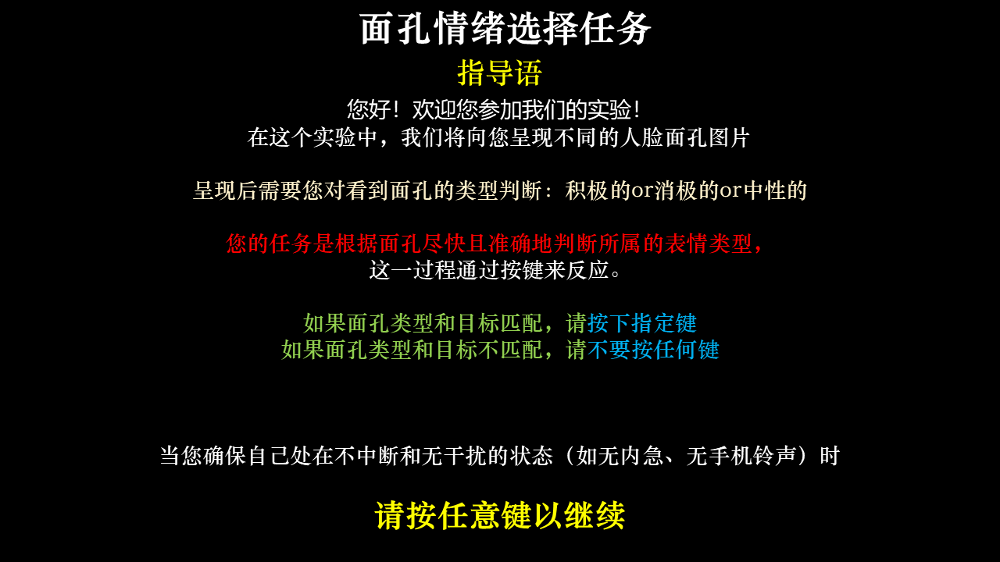
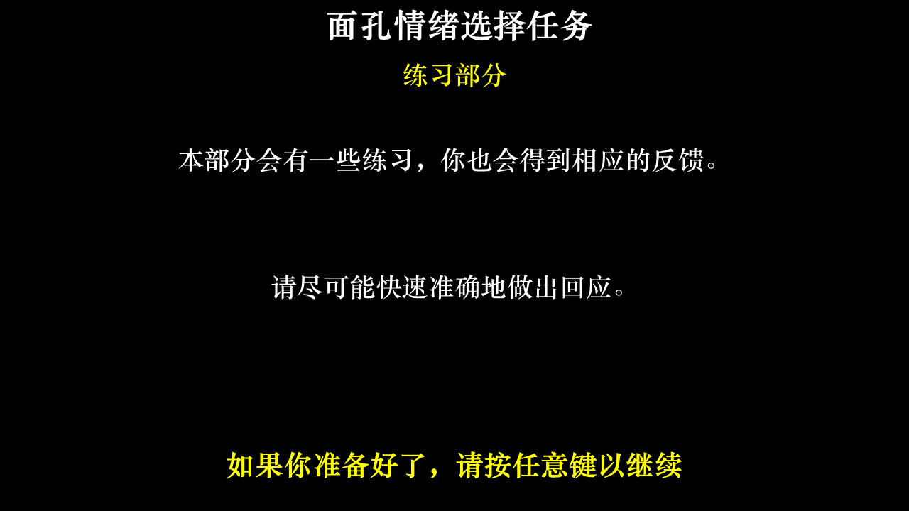
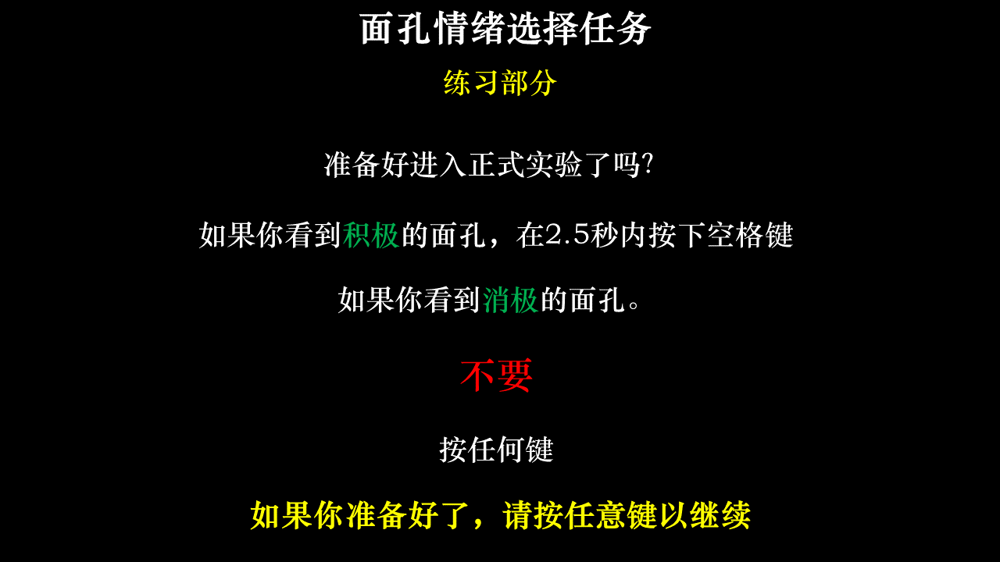
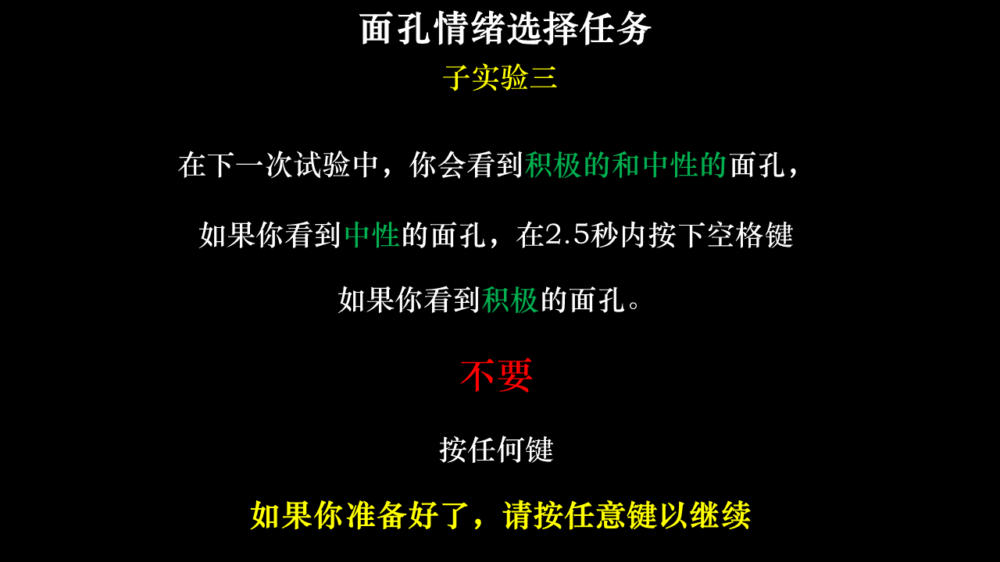
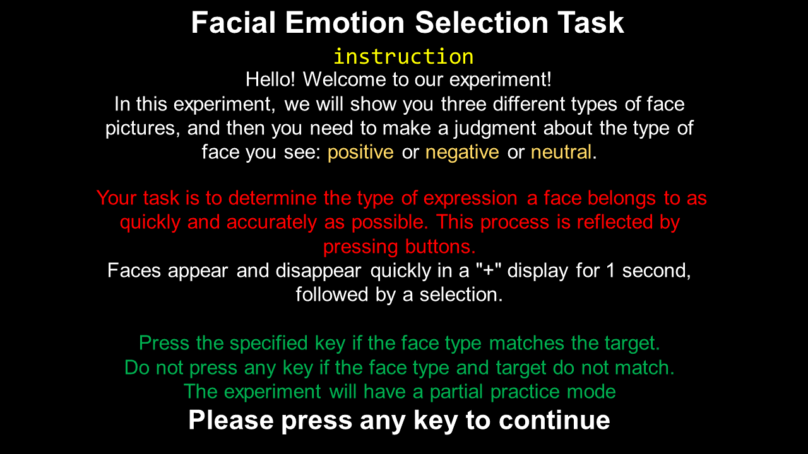
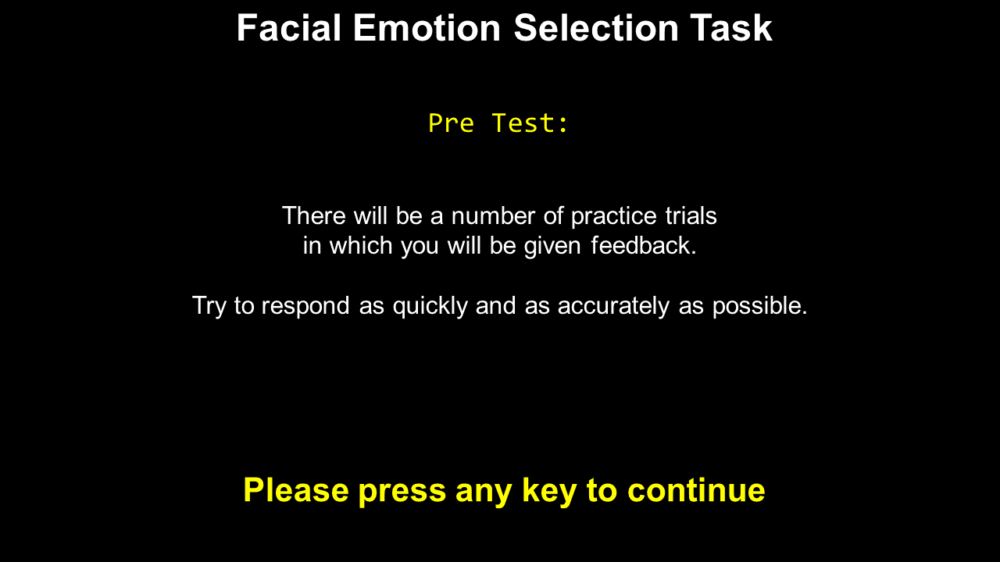
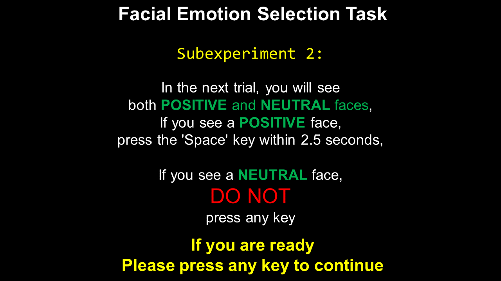
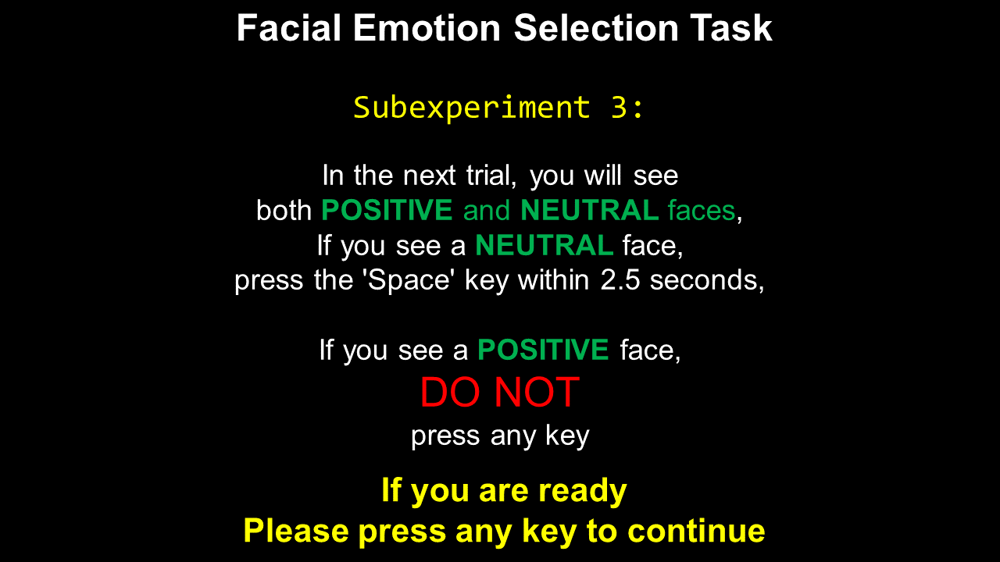

<h1 align="center">🍭Project Emotional_Recognition_go_nogo_Task 情绪面孔Go/nogo任务 </h1>
Project Name Psychopy Experimental programming design(Psychopy 实验编程设计)

> ### Operating System: Windows(可兼容Linux/MacOS)

> ### Programming Language and Version: Python 3.8

This task assesses information processing bias between positive and negative facial expressions.

该任务评估正面和负面面部表情的信息加工偏差

### Task:

> 参与者被告知目标情绪（快乐、悲伤、中性），并要求仅当目标情绪存在时按下按钮。该任务由六个组块组成，每个组块呈现一系列面部表情：

1. 积极目标（看到快乐面孔按键）/消极分心（看到悲伤面孔不能按键）
2. 积极目标/中性分心
3. 中性目标/积极分心
4. 中性目标/消极分心
5. 消极目标/积极分心
6. 消极目标/中性分心。

> Participants view images of faces that are morphed between two emotions of varied intensities. The variants cover continuums from happy to sad, happy to angry or happy to disgusted. Each face is displayed for 150ms, followed by a two-alternative forced choice where they must select one of the two emotions.

1. Happy goal (happy face button)/Sad distraction (sad face button cannot be pressed)
2. Happy goal/Neutral distraction
3. Neutral goal/Happy distraction
4. Neutral goal/Sad distraction
5. Sad goal/Happy distraction
6. Sad goal/Neutral distraction

### Materials:

> 我们选取使用新版中国情绪面孔库图片，中性、正性和负性面孔各60张。

### Statistical Result(Output):

> 计算六种情况下所有“命中”反应的反应时间（RT）。情绪偏差分数通过从快乐目标/悲伤干扰条件RT中减去悲伤目标/快乐干扰条件RT来计算。

> Reaction times (RT) were calculated for all "hit" reactions in the six conditions. The emotional bias score was calculated by subtracting the sad goal/happy interference condition RT from the happy goal/sad interference condition RT.
>
> **Outcome Measures:** Reaction times (RT) were calculated for all “hit” responses for each of the six conditions. *Affective bias* scores were calculated by subtracting the sad target/happy distract condition RT from the happy target/sad distractor condition RT.

### Experimental Procedure：

> 1. 呈现加号界面  1s
> 2. 呈现面孔
> 3. 被试按键
> 4. 记录存储每次的数据情况

* The plus sign is displayed for 1s
* Show faces
* Subject presses the button
* Records the data stored each time

### **指导语部分 Instruction Part**

**中文版**

> **开始部分**
>
> 您好！欢迎您参加我们的实验！

> 在这个实验中，我们将向您呈现3种不同类型的人脸面孔图片，呈现后需要您对看到面孔的类型进行判断：积极的or消极的or中性的

> 您的任务是根据面孔尽快且准确地判断所属的表情类型，这一过程通过按键来反应。其中，面孔会在“+”呈现1秒钟快速呈现和消失，随后呈现系列的选择

> 如果面孔类型和目标匹配，请按下指定键
> 如果面孔类型和目标不匹配，请不要按下任何键

>> 实验会有一部分练习模式
>>

>> 当您确保自己处在不中断和无干扰的状态（如无内急、无手机铃声）时，请按任意键继续
>>

> **子指导语部分**

> 在接下来的试次中，您将会看到消极的和积极的两类面孔

> 如果看到积极的面孔，请在2s内按空格键
> 如果看到消极的面孔，请不要按键

> 如果您已经准备好了
> 请按下任意键以开始实验

**上面的子指导语中，请将面孔类型进行变换演示出上述的6类情况**

> **结束部分**
>
> 您现在已经完成了上机部分的实验，
> 请您休息一会儿，谢谢您的参与！

**English Version**

> **Start Part**
>
> Hello! Welcome to our experiment!
> In this experiment, we will show you three different types of face pictures, and then you need to make a judgment about the type of face you see: positive or negative or neutral

> Your task is to determine the type of expression a face belongs to as quickly and accurately as possible. This process is reflected by pressing buttons. Faces appear and disappear quickly in a "+" display for 1 second, followed by a series of choices

> Press the specified key if the face type matches the target

> Do not press any keys if the face type and target do not match
> The experiment will have a partial practice mode
> If you ensure that you are in a state without interruption and interference (e.g., no emergency, no cell phone ringing),

> please press any key to continue.

> **Subinstruction Part**

> In the next trial, you will see both negative and positive faces
> If you see a positive face, press the 'Space' key within 2 seconds
> If you see a negative face,

> ### ``**DO NOT** ``
>
> press any key
> If you are ready,
> please press any key to start the experiment

> **End Part**
>
> You have now completed the on-computer part of the experiment.

> Please take a break. Thank you for your participation!

# material requirements

> Pre-test: positive male 1 female 1 + negative female 1 male 1 = 4 pictures

> Formal-Test:
>
>> positive male 3 female 3 + negative female 3 male 3 = 12 pictures -> in 1 block
>> 12x6 = 72 pictures
>> Total: 72 + 4 = 76 pictures
>>

# About Data Processing

> If you feel you need to design your own randomization of the display of emotional material, try running the **preprocess.ipynb** file. After running, the content and order of the images in files **trial_A** to **trial_F** will change but the overall number will remain the same.

> At the end of the experiment, relevant results should be presented to the subjects, and the data should be integrated and processed by experimenters in general, so as to screen the required information for the subjects to conduct a series of statistical analysis.
>
>> At this time, we run the **post_process.py** file and input the number of the subjects, and generate the report of the subjects in the output directory. The overall information of the subjects will be presented in the **subjects_results.csv** format, and the subjects can also conduct further statistical analysis by processing **post_process.ipynb**
>>

> 如果你觉得需要自己设计随机化的情绪材料显示方案，请尝试运行 **preprocess.ipynb** 格式文件，运行后**trial_A**到**trial_F**图片内容和顺序会发生改变但是总体数量不会变化

> 实验结束后需要向被试展示相关结果，同时对数据进行总体的整合处理，筛选需要的信息以便于主试进行一系列统计学分析，这时我们运行**post_process.py**文件，输入被试编号即可，生成被试报告在output目录下，被试总体信息在**subjects_results.csv**格式文件中呈现，主试也可以通过处理post_process.ipynb展开进一步数据统计分析操作
